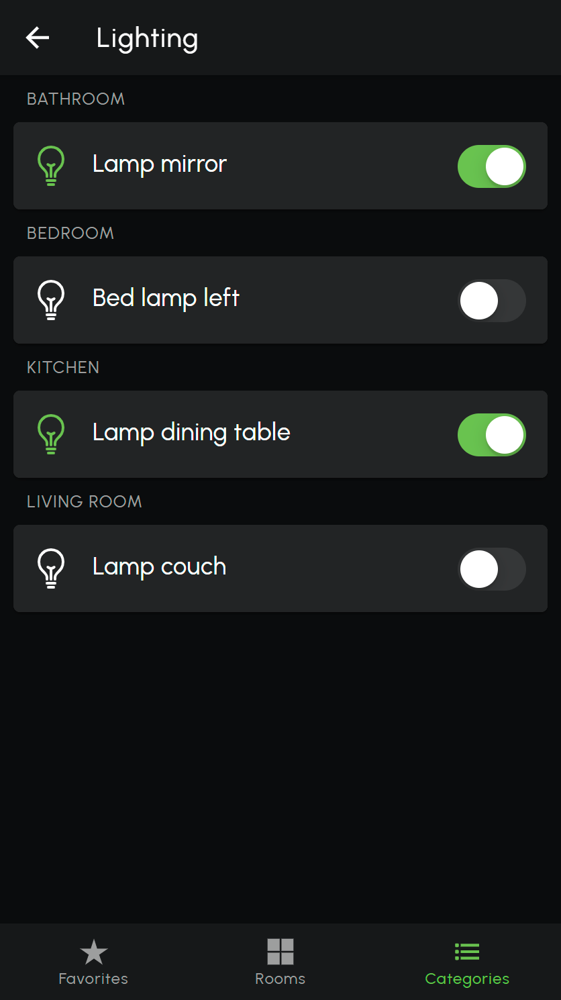

# loxberrypwa

**LoxBerry Progressive Web App (PWA)**

This is an [Ionic](https://ionicframework.com/)-based PWA to be installed on the [LoxBerry](https://loxwiki.atlassian.net/wiki/spaces/LOXBERRY/overview), a Raspberry Pi image offering additional features for the [Loxone](https://www.loxone.com/) smart home automation system.

This App will use the LoxBerry [MQTT Widget](https://wiki.loxberry.de/konfiguration/widget_help/widget_mqtt) and [Lox2MQTT](https://github.com/nufke/LoxBerry-Plugin-Lox2MQTT) to enable the creation of a dynamic user interface with contols defined per rooms and category. The controls defined in this App will get their own [MQTT topic](https://github.com/nufke/loxberrypwa/wiki/MQTT-API) and control interface, enabling interaction and integration with Loxone, LoxBerry, or other platforms such as [Node-RED](https://nodered.org/) or [IOBroker](https://www.iobroker.net/).

The concept of a Progressive Web App (PWA) is used to offer a light-weight development and deployment platform. Most operating systems available today offer the integration of a PWA on the start screen or direct installation as a web app. Obviously, the build flow could be extended to create a stand-alone app for mobile or desktop usage, but this is out-of-scope for this project.

**NOTE: The current version is not production ready. Use it at your own risk.**

## Installation set-up

Make sure you have the packages `nodejs`, `Ionic`, `Angular` and `http-server` installed:
```
npm i -g @ionic/cli
npm i -g @angular/cli
npm i -g http-server
```

Clone this repository:
```
git clone https://github.com/nufke/loxberrypwa.git
```

## Build and test the PWA

You can build and test the PWA as follows:
```
cd loxberrypwa
npm i
ionic build --prod
http-server -p 8080 www
```

The PWA is now accessible for testing via a web-browser at `http://localhost:8080`.

## Configure the App and load a Loxone Miniserver structure over MQTT

First, the MQTT server settings should be configured. Open the menu `Settings` and specify the MQTT server IP address (most probaly your LoxBerry IP address), the MQTT server websocket port, username and password. If necessary, check the MQTT widget settings on your LoxBerry. In addition, you need to specify the Loxone Miniserver Topic (`mqtt_topic_ms`) to receive the Loxone Miniserver structure and control state changes.

After MQTT subscription, the App will listen to MQTT topics. To receive controls, rooms and categories, a Loxone Miniserver JSON structure (e.g. `LoxAPP3.json`) should be sent as string to MQTT topic `<prefix>/structure`:

```
<mqtt_topic_ms>/structure '{ "msInfo": { ... }, "controls": { ... }, "cats": { ... }, "rooms": { ... } }'
```

NOTE: The JSON structure is compatible with the Loxone Miniserver JSON structure. To support additional features, extensions and constrols, the data structure has been extended. More information can be found [here](https://github.com/nufke/loxberrypwa/wiki/JSON-data-model).

After sending the JSON structure, you should see all control elements in the App. You can make updates to any of the elements in the JSON structure at any time, by updating the structure using the same MQTT topic `<mqtt_topic_ms>/structure` or sending updates to the indivdual elements. The updates are incremental, which means existing objects will be changed and overridden and old objects remain available. To flush all elements in the App, an empty string message should be sent to `<mqtt_topic_ms>/structure`.

Alternatively, you can update control, room or category elements separately via MQTT. More information is given [here](https://github.com/nufke/loxberrypwa/wiki/MQTT-API).

When you would like to use local icons and images, you can store them in the directories `assets/icons` and `assets/images` and reference to these directories in the JSON structure, see the [example](https://github.com/nufke/loxberrypwa/wiki/Example).
Alternatively, you can also make use of URLs to your favorite icons and images in the JSON structure, e.g. `http:/myserver.org/my_image.svg`.

**TIP 1**: The LoxBerry plugin [Lox2MQTT](https://github.com/nufke/LoxBerry-Plugin-Lox2MQTT) is able to send the Loxone Miniserver structure over MQTT. In this case, you do not have to create your own JSOn struture object.

**TIP 2**: It is recommended to reuse the icons stored on your Loxone Miniserver, located in `<miniserver IP>/web/images.zip` (version 13.0 and below) or `<miniserver IP>/sys/IconLibrary.zip`  (from version 13.1 onwards).

## Deploy the LoxBerry App

After building and testing the LoxBerry App on your development platform (e.g. Linux desktop), copy the `www` directory to your production server (e.g. LoxBerry or Raspberry Pi) and update the configuration of your webserver (e.g. Apache2) to get access to the webpage the PWA is running. Alternatively, you could use `nodejs` and `http-server` to launch the PWA.

**Note that PWA deployment requires secure connections using HTTPS and WSS, which means your webserver and MQTT server should support this.**

## Screenshots

<div>

&nbsp;&nbsp;

&nbsp;&nbsp;

&nbsp;&nbsp;

</div>

## More information

More information can be found on the [wiki](https://github.com/nufke/loxberrypwa/wiki)
