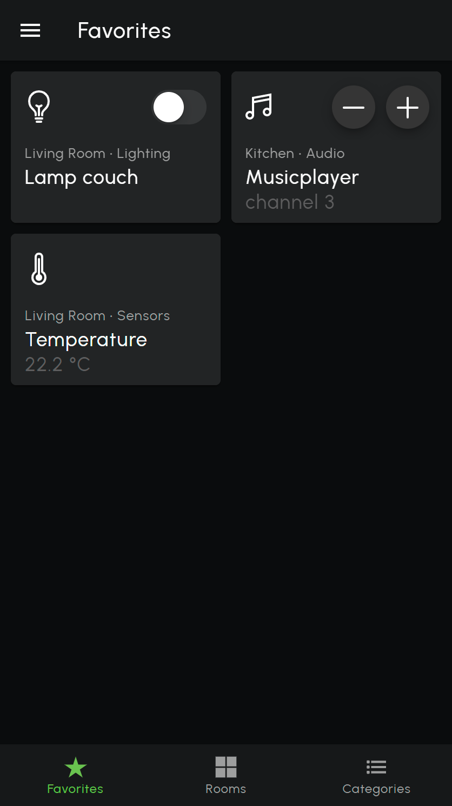
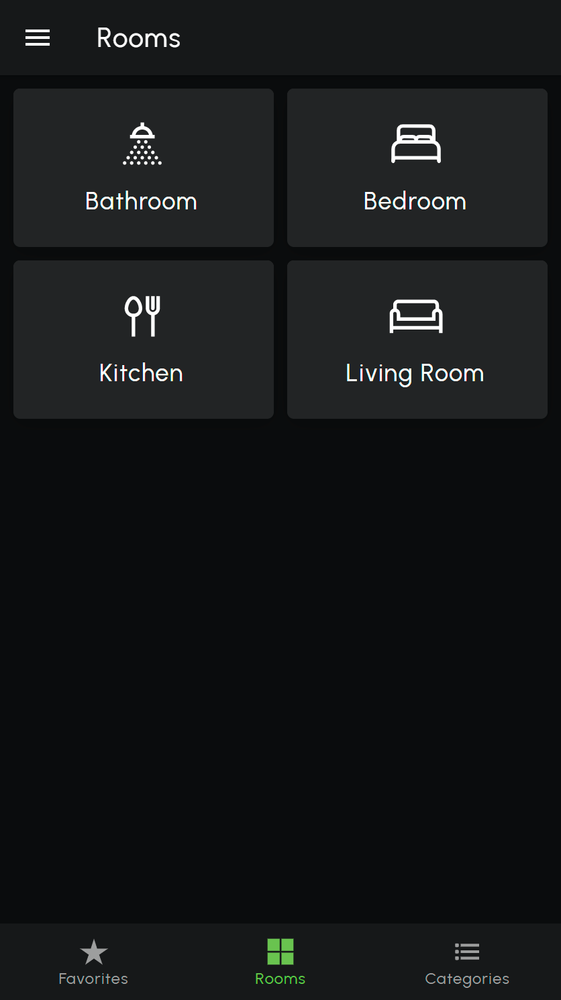

# loxberrypwa

**LoxBerry Progressive Web App (PWA)**

This is an [Ionic](https://ionicframework.com/)-based PWA to be installed on the [LoxBerry](https://loxwiki.atlassian.net/wiki/spaces/LOXBERRY/overview), a Raspberry Pi image offering additional features for the [Loxone](https://www.loxone.com/) smart home automation system.

This App will interact with the LoxBerry [MQTT Gateway](https://wiki.loxberry.de/plugins/mqtt_gateway/start) and [Loxone-MQTT Gateway](https://github.com/nufke/node-lox-mqtt-gateway) to enable the creation of a dynamic user interface with contols defined per rooms and category. The controls defined in this App will get their own [MQTT topic](https://github.com/nufke/loxberrypwa/wiki/MQTT-API) and control interface, enabling interaction and integration with Loxone, LoxBerry, or other platforms such as [Node-RED](https://nodered.org/) or [IOBroker](https://www.iobroker.net/).

The concept of a Progressive Web App is used to offer a light-weight development and deployment platform. Most operating systems available today offer the integration of a PWA on the start screen or direct installation as a web app. Obviously, the build flow could be extended to create a stand-alone app for mobile or desktop usage, but this is out-of-scope for this project.

**NOTE: The current version is not production ready.**

## Installation set-up

Make sure you have the packages `nodejs`, `Ionic`, `Angular` and `http-server` installed:
```
npm i -g @ionic/cli
npm i -g @angular/cli
npm i -g http-server
```

Clone this repository:
```
git clone https://github.com/nufke/loxberrypwa.git
```

## Build and test the PWA

You can build and test the PWA as follows:
```
cd loxberrypwa
npm i
ionic build --prod
http-server -p 8080 www
```

The PWA is now accessible for testing via a web-browser at `http://localhost:8080`.

## Configure the App and load a structure via MQTT

First, the MQTT broker settings should be configured. Open the menu `Settings` and specify the LoxBerry IP address (which is also the MQTT broker IP address), the MQTT broker websocket port, username and password. If necessary, check the MQTT Gateway (2.x) settings on your LoxBerry.

After the configuration, you can send all controls, rooms and categories to the App, by sending a JSON structure to the MQTT topic `/loxberry/app/structure`:
```
/loxberry/app/structure -> { "controls": [ ... ],  "categories": [ ... ], "rooms": [ ... ] }
```
The data model of the JSON obects is given [here](https://github.com/nufke/loxberrypwa/wiki/JSON-data-model). An [example](https://github.com/nufke/loxberrypwa/wiki/Example) is given on the wiki.

After sending the JSON structure, you should see all elements in the App. You can make updates to any of the elements in the JSON structure at any time, by using the same MQTT topic `/loxberry/app/structure` or sending updates to the indivdual elements. The updates are incremental, which means changes to existing objects will be changed or overridden and old objects remain available. To flush all elements in the App, an empty string message should be sent to `/loxberry/app/structure`.

Alternatively, you can update control, room or category elements separately via MQTT. More information is given [here](https://github.com/nufke/loxberrypwa/wiki/MQTT-API).

When you would like to use local icons and images, you can store them in the directories `assets/icons` and `assets/images` and reference to these directories in the JSON structure, see the [example](https://github.com/nufke/loxberrypwa/wiki/Example).
Alternatively, you can also make use of URLs to your favorite icons and images in the JSON structure, e.g. `http:/myserver.org/my_image.svg`.

**TIP 1**: The [Loxone-MQTT Gateway](https://github.com/nufke/node-lox-mqtt-gateway) will create and send the App-specific structure over MQTT, based on the Loxone Miniserver menu structure (`LoxAPP3.json`).

**TIP 2**: It is recommended to reuse the icons stored on your Loxone Miniserver, located in `<miniserver IP>/web/images.zip` (version 13.0 and below) or `<miniserver IP>/sys/IconLibrary.zip`  (from version 13.1 onwards).

## Deploy the PWA

After building and testing the PWA on your development platform (e.g. Linux desktop), copy the `www` directory to your production server (e.g. LoxBerry or Raspberry Pi) and update the configuration of your webserver (e.g. Apache2) to get access to PWA. Alternatively, you could use `nodejs` and `http-server` to launch the PWA.

## Screenshots

<div>

&nbsp;&nbsp;

&nbsp;&nbsp;

&nbsp;&nbsp;

</div>

## More information

More information can be found on the [wiki](https://github.com/nufke/loxberrypwa/wiki)
