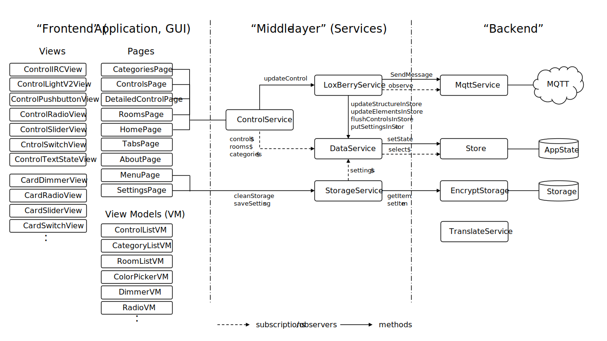

# Development

This page contains information on the development approach and the software architecture for this App.

## Coding Style

The [Google TypeScript Style Guide](https://google.github.io/styleguide/tsguide.html#interfaces-vs-type-aliases) is followed as main coding style.

## App architecture

The image below gives an overview of the App software architecture

The App uses the concept of an *observable store*, to manage the overall App state. A custom, small and simple [RxJS](https://angular.io/guide/rx-library)-based implementation has been realized, without the use of any external packags or dependecies such as [NgRx](https://v7.ngrx.io/guide/store). Of course this has the disadvantage that there are no bindings to DevTools, but for this simple App it was not a requirement.

Different services are introduced acting as *middle layer* to manage the communication between the Application front-end and back-end, to manage Controls, Data and Settings. The most important service is the LoxBerryService, which manages the MQTT communcation to the Broker, and updates the internal App state via the DataService. The application front-end primarily communicates with the ControlService, receiving regular updates of all control states as well as sending control updates based on the user interaction.

The application front-end implements the pages and views for the Graphical User Interface (GUI). The *view model* concept has been introduced to decouple the data model from the App state, focusing on visualization and managing GUI-related state changes in the front-end only, without poluting the central App state.

This architecture has been created to manage the dynamics in state changes in front-end and back-end at the same time, where user interaction via the GUI happens concurrently with MQTT updates coming from other application via a MQTT Broker.
